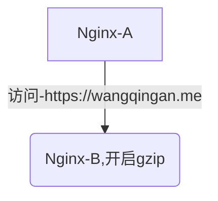

### ngx_http_sub_module

#### 背景
项目中为适配不同的浏览器,想通过`ngx_http_sub_module`直接修改页面部分代码.

```
location / {
    #例子
    proxy_set_header Accept-Encoding "";
    proxy_pass https://wangqingan.me/ ;
    sub_filter	'IE=edge'	'chrome=1';
    sub_filter_types text / html;
}
```

这里的`proxy_set_header Accept-Encoding ""`特别重要,就是告诉不要压缩响应.
因为访问`https://wangqingan.me`同样经过nginx,由于这台nginx开起来gzip,
不加上`Accept-Encoding`就会不起作用.




### 参考
[ngx_http_sub_module](http://nginx.org/en/docs/http/ngx_http_sub_module.html#sub_filter_types)

[Sub-filter-accept-encoding](https://serverfault.com/questions/547060/why-does-sub-filter-seem-to-not-work-when-used-in-conjunction-with-proxy-pass)

[nginx-reverse-proxy-with-code-injection](https://blog.fhrnet.eu/2017/09/20/nginx-reverse-proxy-with-code-injection/)

[Nginx 开启 gzip 造成的乱码问题](https://ialloc.org/blog/how-nginx-gzip-works/#_3)