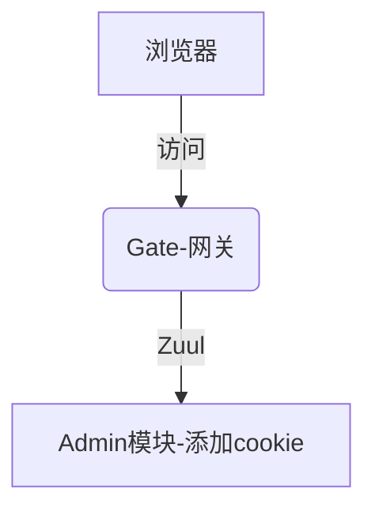

### Spring Cloud 微服务添加Cookie失效问题




#### 问题描述
如上图所示,微服务架构中的所有服务都是通过网关的Zuul.项目里面在开发下载的时候需要添加一个cookie信息,这样前端才能异步获悉是否下载结束.

添加cookie的代码如下:
```
//在这里加入设置Cookie   ------------- 方便filedown异步轮询
Cookie fileDownload=new Cookie("fileDownload", "true");
fileDownload.setPath("/");
response.addCookie(fileDownload);
```

Response Headers:
```
HTTP/1.1 200 OK
Expires: 0
Cache-Control: no-cache, no-store, max-age=0, must-revalidate
X-XSS-Protection: 1; mode=block
Pragma: no-cache
Content-disposition: attachment; filename=内蒙古银行-2018-10-25.xlsx
Date: Thu, 25 Oct 2018 02:26:17 GMT
Connection: keep-alive
Transfer-Encoding: chunked
Content-Type: application/octet-stream
```

通过上面的响应头,我们发现在微服务中添加的Cookie并没有生效

#### 解决方案
由于`Zuul Client`会在微服务响应之后默认会过滤掉Header中的`Cookie,Set-Cookie,Authorization`,所以如果要将Cookie发送给前端,在`Zuul Routes`中必须包含`sensitiveHeaders`配置:
```
zuul:
  routes:
    back:
      path: /back/**
      #sensitiveHeaders是黑名单,
      sensitiveHeaders:
      serviceId: admin-back
```

修改之后的Response Headers:
```
HTTP/1.1 200 OK
Expires: 0
Cache-Control: no-cache, no-store, max-age=0, must-revalidate
Set-Cookie: fileDownload=true; path=/
X-XSS-Protection: 1; mode=block
Pragma: no-cache
Content-disposition: attachment; filename=内蒙古银行-2018-10-25.xlsx
Date: Thu, 25 Oct 2018 02:46:58 GMT
Connection: keep-alive
Transfer-Encoding: chunked
Content-Type: application/octet-stream
```

#### Zuul Route 原理

[TBD 之后补充]


#### 参考
[Zuul Client Cookies and Sensitive Headers](https://github.com/spring-cloud/spring-cloud-netflix/blob/master/docs/src/main/asciidoc/spring-cloud-netflix.adoc#cookies-and-sensitive-headers)